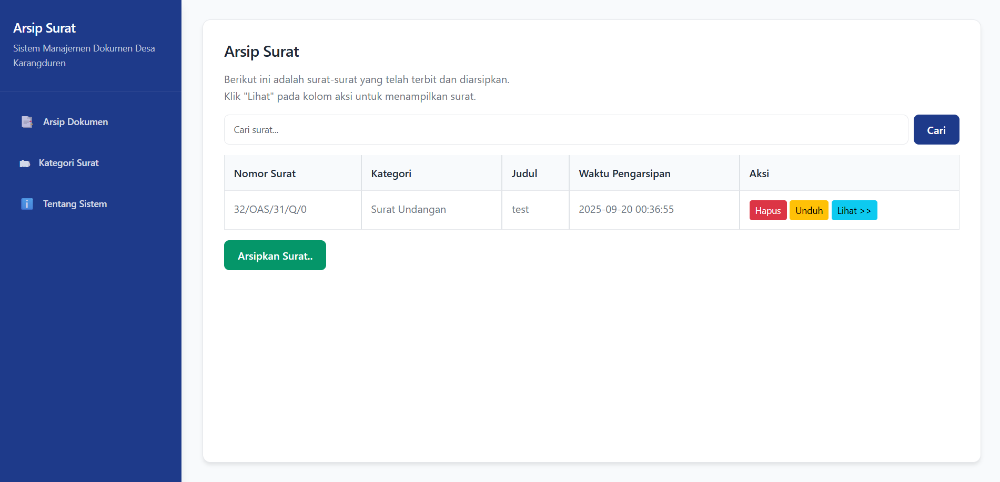
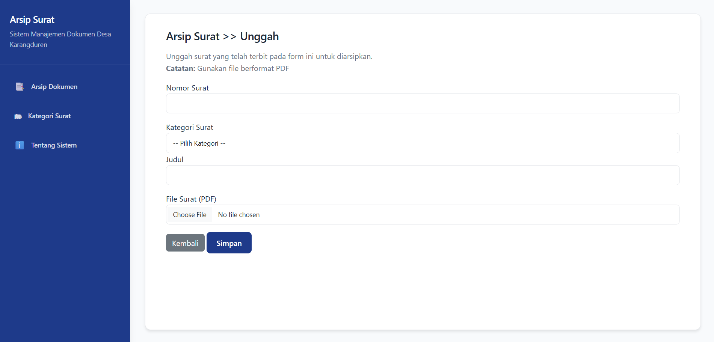
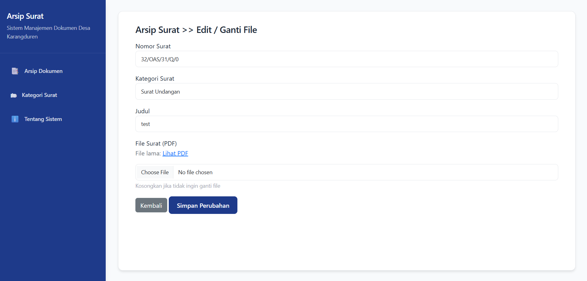
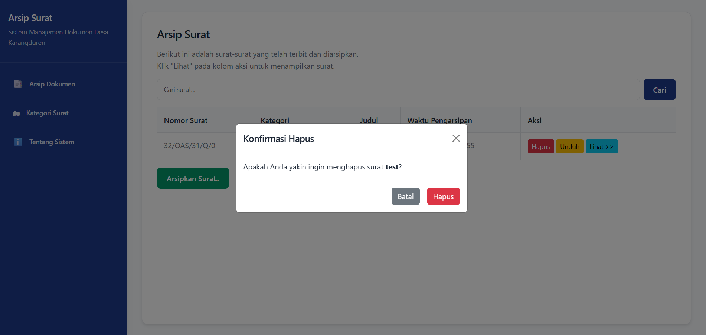
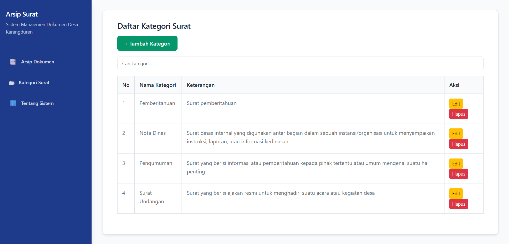
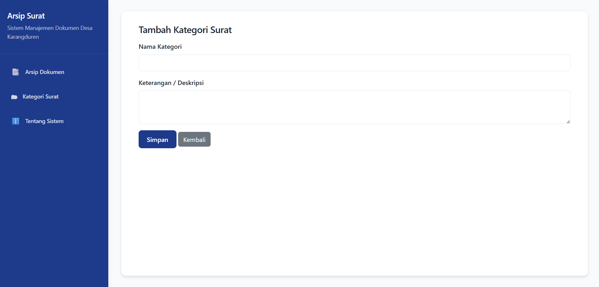
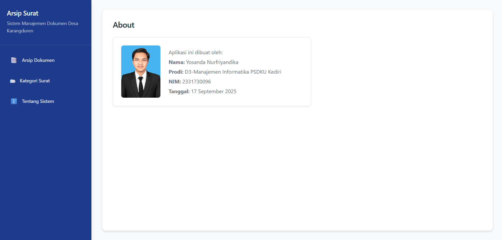

<p align="center">
    <a href="https://laravel.com" target="_blank">
        
    </a>
</p>

<h2 align="center">Aplikasi Arsip Surat Digital</h2>

---

## Deskripsi
Aplikasi ini dirancang untuk membantu pengelolaan dokumen surat secara digital, mulai dari penyimpanan, pencarian, pengelompokan berdasarkan kategori, hingga pengunduhan file PDF.

## Fitur Utama
- **Kelola Arsip Surat:**  
  Tambah, edit, dan hapus data surat dengan kategori yang dapat dipilih.
- **Pencarian Surat:**  
  Temukan surat dengan mudah melalui fitur pencarian berdasarkan judul.
- **Upload & Download PDF:**  
  Simpan file surat dalam format PDF dan unduh sesuai kebutuhan.
- **Detail Surat:**  
  Lihat informasi lengkap surat beserta preview file PDF.
- **Manajemen Kategori:**  
  Buat, ubah, dan hapus kategori surat sesuai kebutuhan.
- **Halaman Profil:**  
  Tampilkan informasi pembuat aplikasi dan tanggal pembuatan.

## Cara Instalasi
1. Clone repository:
   ```
   git clone https://github.com/Exton-wz/ARSIP-SURAT-KARANGDUREN.git
   ```
2. Masuk ke direktori project:
   ```
   cd karangduren-arsip
   ```
3. Install dependency Laravel:
   ```
   composer install
   ```
4. Salin file konfigurasi:
   ```
   cp .env.example .env
   ```
5. Generate application key:
   ```
   php artisan key:generate
   ```
6. Buat symlink storage:
   ```
   php artisan storage:link
   ```
7. Migrasi database:
   ```
   php artisan migrate
   ```
8. Jalankan server:
   ```
   php artisan serve
   ```

## Dokumentasi Tampilan
- **Dashboard Arsip Surat**  
  
- **Form Input Surat**  
  
- **Edit Data Surat**  
  
- **Konfirmasi Hapus Surat**  
  
- **Preview Surat PDF**  
  
- **Kelola Kategori Surat**  
  
- **Tambah Kategori Baru**  
  
- **Edit Kategori Surat**  
  
- **Hapus Kategori**  
  
- **Profil Pengembang**  
  
